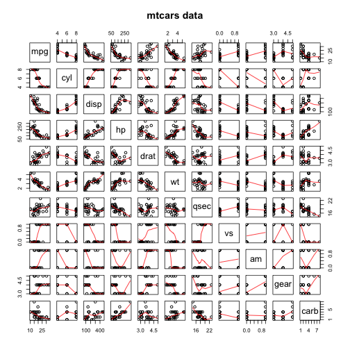

### Problem Statement - Author Shiny App for Predicting mpg using mtcars
### Data Frame Format

```r
[, 1]	mpg	Miles/(US) gallon
[, 2]	cyl	Number of cylinders
[, 3]	disp	Displacement (cu.in.)
[, 4]	hp	Gross horsepower
[, 5]	drat	Rear axle ratio
[, 6]	wt	Weight (lb/1000)
[, 7]	qsec	1/4 mile time
[, 8]	vs	V/S
[, 9]	am	Transmission (0 = automatic, 1 = manual)
[,10]	gear	Number of forward gears
[,11]	carb	Number of carburetors
```

### Model Selection - Backward Elimination Strategy.   

---

#### Too many predictor variables, so we use Akaike information criterion (AIC) to narrow down to the best model. 


```r
Step:  AIC=61.31
mpg ~ wt + qsec + am

Call:
    lm(formula = mpg ~ wt + qsec + am, data = mtcars)

Coefficients:
    (Intercept)           wt         qsec           am  
9.618       -3.917        1.226        2.936  
```

---

 

As expected we see mpg is closely predicted by qsec, am and wt 

---

#### Shiny App Overview 

* Slider for selecting qsec ( range: min to max of qsec plane)
* Slider for selecting wt   ( range: min to max of wt plane)
* Radio Button for selecting automatic vs manual 

mpg is computed using the regression formula 

__Intercept + coefficents(wt) * input(weight) + coefficents(qsec) * input(qsec) + coefficents(am) * input(am)__

Here input(param) means param passed as input from ui.R to server.R 

TextOutput control for displaying mpg

[Git Source Code](https://github.com/raoyvn/DataProducts/tree/gh-pages/DevelopingDataProducts) 
[Shiny App](https://raoyvn.shinyapps.io/DevelopingDataProducts)


